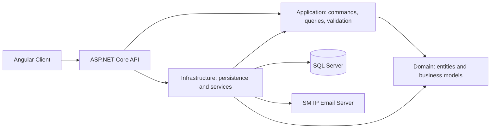

<div align="center">

# 📦 Inventory Management System

### From purchasing to stock visibility — one connected workspace.

A full-stack inventory application built with **Angular**, **ASP.NET Core**, and **SQL Server**.
Manage product catalogs, suppliers, purchasing, goods receipts, and warehouse stock through a unified web interface.


**Clean Architecture · CQRS · Cookie-based JWT · Multi-company Tenancy · Printing · SMTP Email**

[Features](#-features) · [Skills demonstrated](#-skills-demonstrated) · [Security and tenancy](#-security-and-tenancy) · [Architecture](#-architecture) · [Run locally](#-run-locally) · [Roadmap](#-roadmap)

</div>

---

## ✨ Features

| Area | Capabilities |
| :--- | :--- |
| **Product catalog** | Products, categories, packaging, and barcode generation |
| **Units of measure** | UOM categories, units, and product-specific conversions |
| **Supplier management** | Supplier records supporting purchasing workflows |
| **Warehouse organization** | Warehouses and storage locations |
| **Purchasing** | Purchase orders with printable document views |
| **Goods receiving** | Goods receipt records and printable receipt views |
| **Document printing** | Dedicated purchase-order and goods-receipt preview dialogs with browser printing |
| **Supplier email** | Purchase-order email previews and SMTP delivery through MailKit |
| **Inventory tracking** | Stock transaction browsing |
| **Dashboard** | Product counts, low-stock indicators, stock valuation, and recent transactions |
| **Company management** | Company records and company-scoped inventory data |
| **Authentication** | ASP.NET Core Identity, JWT access and refresh tokens stored in HttpOnly cookies |
| **Role-aware behavior** | Identity roles and role claims, including Administrator and SuperAdmin |
| **Tenant-aware persistence** | Company context, automatic company assignment, and EF Core global query filters |
| **CSRF integration** | ASP.NET Core antiforgery token issuance and Angular X-XSRF-TOKEN request headers |
| **Audit metadata** | Creation and modification metadata applied during persistence |
| **Data exchange** | Spreadsheet and CSV export infrastructure |
| **API exploration** | OpenAPI documentation with a Scalar interface in Development |

## 🧠 Skills demonstrated

This project highlights implementation skills across the frontend, backend, and data layers.

| Skill | Evidence in the codebase |
| :--- | :--- |
| **Full-stack development** | Angular feature pages integrated with ASP.NET Core API controllers |
| **Application architecture** | Separate Domain, Application, Infrastructure, API, and Client projects |
| **CQRS and request handling** | Commands and queries organized by feature, using MediatR |
| **Input validation** | FluentValidation validators in the application layer |
| **Relational data modeling** | EF Core entities, SQL Server persistence, and database migrations |
| **Identity and access** | Identity users and roles, JWT validation, and token refresh handling |
| **Browser authentication integration** | HttpOnly authentication cookies, antiforgery token issuance, and an Angular HTTP interceptor |
| **Multi-tenant data access** | Current-user company context, company assignment on insert, and global query filters |
| **Role-aware application behavior** | Role claims and privileged-role checks in the current-user service |
| **Email integration** | MailKit SMTP service, purchase-order email previews, and application-layer delivery commands |
| **Print workflows** | Dedicated Angular document dialogs and iframe-based browser printing |
| **Audit tracking** | Automatic creation and modification metadata in the EF Core save pipeline |
| **Business workflow modeling** | Purchase orders, goods receipts, stock records, and UOM conversions |
| **Frontend engineering** | TypeScript models and services, Angular routing, and reusable dialogs |
| **UI development** | PrimeNG components, Tailwind CSS, and feature-specific styles |
| **Document and data tooling** | Barcode generation, printable documents, and spreadsheet/CSV libraries |
| **API design** | Feature-based controllers, OpenAPI, and centralized exception handling |
| **Dependency injection** | Service registration and application interfaces separating implementation details |

## 🔐 Security and tenancy

- **Authentication:** Access and refresh tokens use HttpOnly cookies; cookie security settings adapt to HTTPS. Protected inventory controllers require authentication.
- **CSRF foundations:** The API issues an `XSRF-TOKEN` cookie and configures `X-XSRF-TOKEN` as the antiforgery header. The Angular interceptor attaches that header to mutating requests. Server-side antiforgery validation is not currently wired into the inspected controllers or request pipeline, so this is integration groundwork rather than complete CSRF enforcement.
- **Role-based foundations:** Identity maintains roles and emits role claims. The current-user service checks `Administrator` and `SuperAdmin` for privileged data access. Fine-grained role restrictions on management endpoints remain a roadmap item.
- **Company tenancy:** Inventory entities use company-scoped EF Core query filters, and new company-aware entities inherit the current company when none is supplied. The current implementation lets both `Administrator` and `SuperAdmin` bypass company filters; it also bypasses filters when no authenticated user context exists. These filters are an application data-access mechanism, not a claim of audited tenant isolation.
- **Audit metadata:** The persistence layer records who created or modified auditable entities and when.

## 🏗 Architecture



The Application layer defines use cases and interfaces. Infrastructure implements persistence and external services. The API composes these layers and exposes HTTP endpoints, while the Angular client provides the user interface.

```text
src/
├── InventoryManagementSystem.Domain/          # Entities and domain models
├── InventoryManagementSystem.Application/     # Commands, queries, validators, interfaces
├── InventoryManagementSystem.Infrastructure/  # EF Core, Identity, migrations, services
├── InventoryManagementSystem.Api/             # Controllers, middleware, API configuration
└── InventoryManagementSystem.Client/          # Angular pages, models, services, UI
```

## 🛠 Technology stack

| Layer | Technologies |
| :--- | :--- |
| **Frontend** | Angular 20, TypeScript 5.9, RxJS, PrimeNG 20, PrimeIcons, Tailwind CSS 4 |
| **Backend** | C#, ASP.NET Core / .NET 10, MediatR, FluentValidation |
| **Database** | SQL Server, Entity Framework Core 10 |
| **Authentication and security** | ASP.NET Core Identity, JWT bearer authentication, HttpOnly cookies, antiforgery token integration |
| **Email** | MailKit, configurable SMTP transport |
| **API tooling** | OpenAPI, Scalar |
| **Data and documents** | ExcelJS, SheetJS, ClosedXML, CsvHelper, JsBarcode |
| **Frontend test tooling** | Jasmine, Karma |

## 🚀 Run locally

### Prerequisites

- .NET 10 SDK
- Node.js compatible with the Angular CLI version in the client lockfile
- npm
- A running SQL Server instance with permission to create or migrate the application database

### 1. Clone the repository

```bash
git clone https://github.com/Sitt-Paing/InventoryManagementSystem.git
cd InventoryManagementSystem
```

### 2. Configure the API

Use local .NET user secrets for the connection string and development administrator. The following commands run from the repository root; replace the example values for your environment.

```powershell
dotnet user-secrets set "ConnectionStrings:DefaultConnection" "Server=localhost;Database=InventoryManagement;Trusted_Connection=True;TrustServerCertificate=True" --project src/InventoryManagementSystem.Api
dotnet user-secrets set "JwtSettings:SecretKey" "replace-with-your-own-random-secret-at-least-32-characters" --project src/InventoryManagementSystem.Api
dotnet user-secrets set "DefaultAdmin:UserName" "localadmin" --project src/InventoryManagementSystem.Api
dotnet user-secrets set "DefaultAdmin:Email" "localadmin@example.com" --project src/InventoryManagementSystem.Api
dotnet user-secrets set "DefaultAdmin:Password" "replace-with-your-own-strong-password" --project src/InventoryManagementSystem.Api
```

Choose an administrator password containing uppercase and lowercase letters and a digit, with at least six characters. On a fresh Development database, startup applies migrations for both database contexts and seeds administrator roles and the configured administrator. Existing users are not overwritten by changing seed settings. Check startup logs if database initialization fails.

### 3. Start the backend

```powershell
dotnet dev-certs https --trust
dotnet restore src/InventoryManagementSystem.Api/InventoryManagementSystem.Api.csproj
dotnet run --project src/InventoryManagementSystem.Api --launch-profile https
```

### 4. Start the frontend

In a second terminal:

```bash
cd src/InventoryManagementSystem.Client
npm ci
npm start
```

The development client points to `https://localhost:7152/api` in `src/InventoryManagementSystem.Client/src/environments/environment.ts`.

| Service | Local URL |
| :--- | :--- |
| **Web application** | http://localhost:4200 (use the URL reported by Angular CLI) |
| **API base** | https://localhost:7152/api |
| **API documentation** | https://localhost:7152/docs/scalar |

Sign in with the administrator credentials configured above.

### Optional: configure purchase-order email

Set `SmtpSettings:Host`, `Port`, `UserName`, `Password`, `FromEmail`, `FromName`, and `UserStartTls` through user secrets or environment variables. `UserStartTls` is the configuration key used by the code. Use your SMTP provider's connection settings and your own test recipient when trying the send action.

The committed implementation supports SMTP delivery. A RabbitMQ-backed outbox worker with delivery status, retries, and idempotency is currently being developed in the local working tree and is not included in this README-only commit.

## 🗺 Roadmap

Upcoming product features:

- [ ] **Reporting:** Add dedicated reporting features.
- [ ] **Expanded management:** Add further management features beyond the existing company and master-data screens.

Security follow-ups identified in the current implementation:

- [ ] Enforce server-side antiforgery validation for cookie-authenticated mutating requests.
- [ ] Apply explicit role authorization to privileged management operations.
- [ ] Refine tenant administrator scope and verify company boundaries across reads and writes.

Reporting and expanded management are planned additions, not completed modules.

## ✅ Development commands

Build the API and its referenced projects from the repository root:

```bash
dotnet build src/InventoryManagementSystem.Api/InventoryManagementSystem.Api.csproj
```

Run frontend commands from `src/InventoryManagementSystem.Client`:

```bash
npm run build
npm test
```

`npm test` launches the configured Karma/Jasmine runner and requires a compatible browser. These are development commands; their presence does not imply a passing test suite or a published deployment.

---

<div align="center">

**Built by [Sitt-Paing](https://github.com/Sitt-Paing)**

Exploring practical inventory workflows through full-stack software engineering.

</div>
