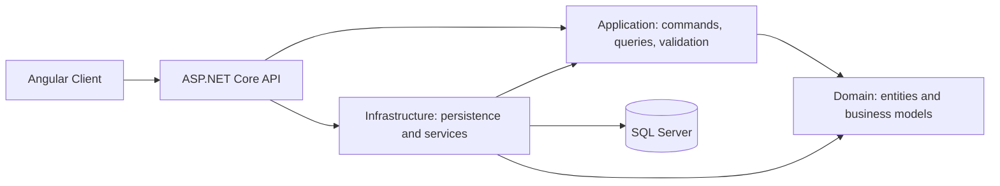

<div align="center">

# 📦 Inventory Management System

### From purchasing to stock visibility — one connected workspace.

A full-stack inventory application built with **Angular**, **ASP.NET Core**, and **SQL Server**.
Manage product catalogs, suppliers, purchasing, goods receipts, and warehouse stock through a unified web interface.


**Clean Architecture · CQRS · JWT Authentication · PrimeNG · Tailwind CSS**

[Features](#-features) · [Skills demonstrated](#-skills-demonstrated) · [Architecture](#-architecture) · [Run locally](#-run-locally)

</div>

---

## ✨ Features

| Area | Capabilities |
| :--- | :--- |
| **Product catalog** | Products, categories, packaging, and barcode generation |
| **Units of measure** | UOM categories, units, and product-specific conversions |
| **Supplier management** | Supplier records supporting purchasing workflows |
| **Warehouse organization** | Warehouses and storage locations |
| **Purchasing** | Purchase orders with printable document views |
| **Goods receiving** | Goods receipt records and printable receipt views |
| **Inventory tracking** | Stock transaction browsing |
| **Dashboard** | Product counts, low-stock indicators, stock valuation, and recent transactions |
| **Company management** | Company records and company-scoped inventory data |
| **Authentication** | ASP.NET Core Identity, JWT access tokens, and refresh tokens |
| **Data exchange** | Spreadsheet and CSV export infrastructure |
| **API exploration** | OpenAPI documentation with a Scalar interface in Development |

## 🧠 Skills demonstrated

This project highlights implementation skills across the frontend, backend, and data layers.

| Skill | Evidence in the codebase |
| :--- | :--- |
| **Full-stack development** | Angular feature pages integrated with ASP.NET Core API controllers |
| **Application architecture** | Separate Domain, Application, Infrastructure, API, and Client projects |
| **CQRS and request handling** | Commands and queries organized by feature, using MediatR |
| **Input validation** | FluentValidation validators in the application layer |
| **Relational data modeling** | EF Core entities, SQL Server persistence, and database migrations |
| **Identity and access** | Identity users and roles, JWT validation, and token refresh handling |
| **Business workflow modeling** | Purchase orders, goods receipts, stock records, and UOM conversions |
| **Frontend engineering** | TypeScript models and services, Angular routing, and reusable dialogs |
| **UI development** | PrimeNG components, Tailwind CSS, and feature-specific styles |
| **Document and data tooling** | Barcode generation, printable documents, and spreadsheet/CSV libraries |
| **API design** | Feature-based controllers, OpenAPI, and centralized exception handling |
| **Dependency injection** | Service registration and application interfaces separating implementation details |

## 🏗 Architecture



The Application layer defines use cases and interfaces. Infrastructure implements persistence and external services. The API composes these layers and exposes HTTP endpoints, while the Angular client provides the user interface.

```text
src/
├── InventoryManagementSystem.Domain/          # Entities and domain models
├── InventoryManagementSystem.Application/     # Commands, queries, validators, interfaces
├── InventoryManagementSystem.Infrastructure/  # EF Core, Identity, migrations, services
├── InventoryManagementSystem.Api/             # Controllers, middleware, API configuration
└── InventoryManagementSystem.Client/          # Angular pages, models, services, UI
```

## 🛠 Technology stack

| Layer | Technologies |
| :--- | :--- |
| **Frontend** | Angular 20, TypeScript 5.9, RxJS, PrimeNG 20, PrimeIcons, Tailwind CSS 4 |
| **Backend** | C#, ASP.NET Core / .NET 10, MediatR, FluentValidation |
| **Database** | SQL Server, Entity Framework Core 10 |
| **Authentication** | ASP.NET Core Identity, JWT bearer authentication |
| **API tooling** | OpenAPI, Scalar |
| **Data and documents** | ExcelJS, SheetJS, ClosedXML, CsvHelper, JsBarcode |
| **Frontend test tooling** | Jasmine, Karma |

## 🚀 Run locally

### Prerequisites

- .NET 10 SDK
- Node.js compatible with the Angular CLI version in the client lockfile
- npm
- A running SQL Server instance with permission to create or migrate the application database

### 1. Clone the repository

```bash
git clone https://github.com/Sitt-Paing/InventoryManagementSystem.git
cd InventoryManagementSystem
```

### 2. Configure the API

Use local .NET user secrets for the connection string and development administrator. The following commands run from the repository root; replace the example values for your environment.

```powershell
dotnet user-secrets set "ConnectionStrings:DefaultConnection" "Server=localhost;Database=InventoryManagement;Trusted_Connection=True;TrustServerCertificate=True" --project src/InventoryManagementSystem.Api
dotnet user-secrets set "JwtSettings:SecretKey" "replace-with-your-own-random-secret-at-least-32-characters" --project src/InventoryManagementSystem.Api
dotnet user-secrets set "DefaultAdmin:UserName" "localadmin" --project src/InventoryManagementSystem.Api
dotnet user-secrets set "DefaultAdmin:Email" "localadmin@example.com" --project src/InventoryManagementSystem.Api
dotnet user-secrets set "DefaultAdmin:Password" "replace-with-your-own-strong-password" --project src/InventoryManagementSystem.Api
```

Choose an administrator password containing uppercase and lowercase letters and a digit, with at least six characters. On a fresh Development database, startup applies migrations for both database contexts and seeds administrator roles and the configured administrator. Existing users are not overwritten by changing seed settings. Check startup logs if database initialization fails.

### 3. Start the backend

```powershell
dotnet dev-certs https --trust
dotnet restore src/InventoryManagementSystem.Api/InventoryManagementSystem.Api.csproj
dotnet run --project src/InventoryManagementSystem.Api --launch-profile https
```

### 4. Start the frontend

In a second terminal:

```bash
cd src/InventoryManagementSystem.Client
npm ci
npm start
```

The development client points to `https://localhost:7152/api` in `src/InventoryManagementSystem.Client/src/environments/environment.ts`.

| Service | Local URL |
| :--- | :--- |
| **Web application** | http://localhost:4200 (use the URL reported by Angular CLI) |
| **API base** | https://localhost:7152/api |
| **API documentation** | https://localhost:7152/docs/scalar |

Sign in with the administrator credentials configured above.

## ✅ Development commands

Build the API and its referenced projects from the repository root:

```bash
dotnet build src/InventoryManagementSystem.Api/InventoryManagementSystem.Api.csproj
```

Run frontend commands from `src/InventoryManagementSystem.Client`:

```bash
npm run build
npm test
```

`npm test` launches the configured Karma/Jasmine runner and requires a compatible browser. These are development commands; their presence does not imply a passing test suite or a published deployment.

---

<div align="center">

**Built by [Sitt-Paing](https://github.com/Sitt-Paing)**

Exploring practical inventory workflows through full-stack software engineering.

</div>
